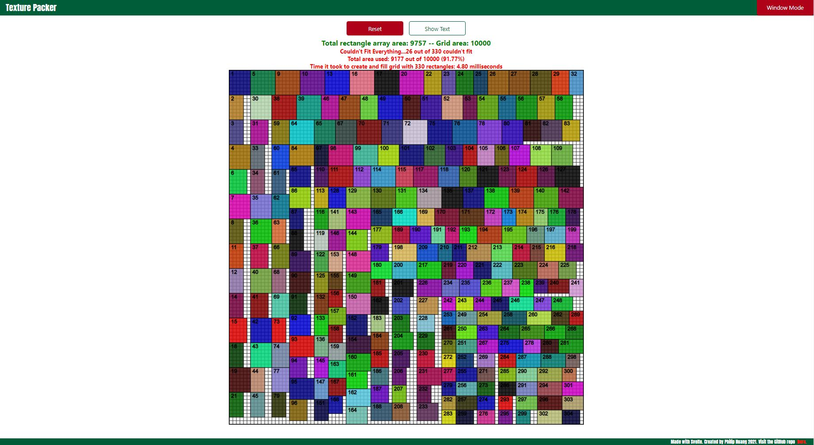

<a href="https://serene-boyd-a278d4.netlify.app/" alt="Texture Packer">
  </a>
  
<h1 align="center">Texture Packer Visualization</h1>

<p align="center">
  
  
  
  
</p>

## Background

I was assigned a texture packer problem and as I researched more into the NP-hard problem, the more invested I was. As I built the algorithm, it was hard to visualize just what was happening at first. However, slowly but surely, I pieced together a way to visualize it in a way that looked both informative and captivating at the same time. 

## Setting up

```shell
git clone https://github.com/PhilHuangSW/TexturePacker.git
cd TexturePacker
npm install
npm run dev
```

You can also visit https://serene-boyd-a278d4.netlify.app/ for the web version, hosted by Netlify.

## Features

There were many features I kept wanting to add, but here are the ones I settled on:
 - User options including width, height, number of rectangles, and min/max size of rectangles
 - Timed Interval feature to visually see the algorithm at work
 - Dynamically rendered statistics 
 - Windowed Mode to automatically run the algorithm whenever the window size changes
 - Near instant packing algorithm using Binary Search

## Technologies

Website is created with: 

<a href="https://svelte.dev/" alt="svelte main page">
  </a>

<a href="https://rollupjs.org/guide/en/" alt="rollup main page">
  </a>

<a href="" alt="JavaScript">
  </a>
  
<a href="" alt="HTML">
</a>

<a href="" alt="CSS">
</a>

## Future Improvements

- [ ] Different algorithm implementations
- [ ] Improve scaling algorithm
- [ ] Improve mobile experience
- [ ] UI update

## Contact Me

If you have any suggestions on how I can improve the user experience or you just want to chat with me about 2d bin packing algorithms, email me at philip.sw.huang@gmail.com
